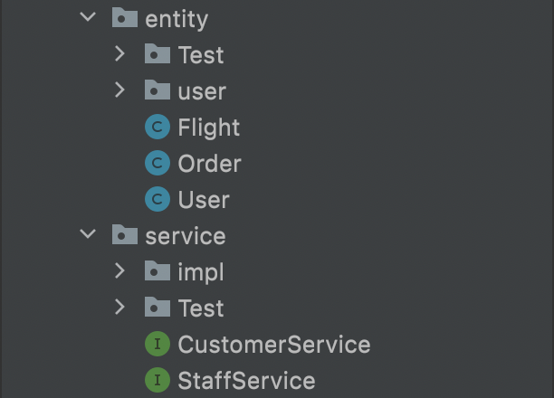
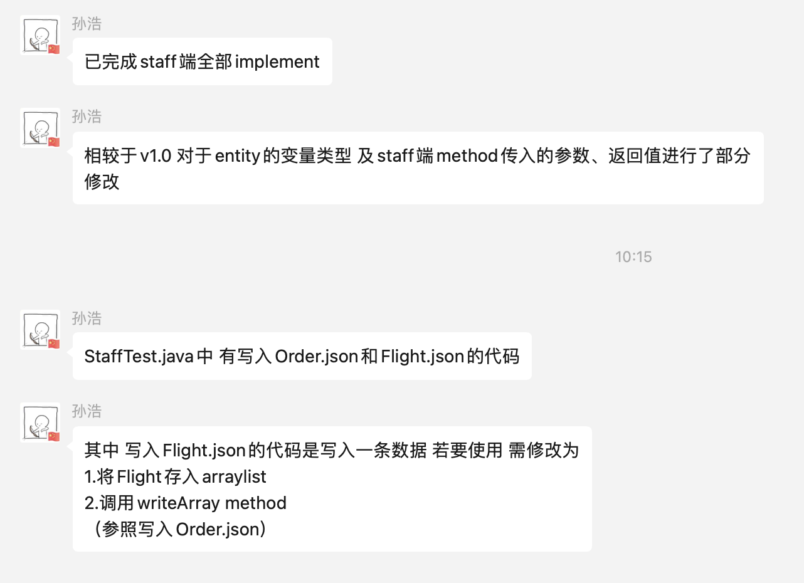

***
###Software engineering - Group 79. _Work Diary_
***
###`v1.0` Entity class; Service Interface; File menu
####1. All the entity class and service interface. Test successfully!

>
####2. Define the file menu with project
>customer.json -- Arraylist<Customer> 
> 
>staff.json -- Arraylist<Staff> 
> 
>order.json -- Arraylist<Order> 
> 
>flight.json -- Arraylist<Flight>

***2022.3.22-2022.3.23*** 

***@author Chenyang He; Hao Sun***
***
###`v1.1` File util; Staff implementation
####1. The util package used to get IO stream in JSON format.
> `@code{util.file.JSONController}`
> `@code{util.file.IOController}`
####2. Finish the interface in staff's service
>
> 
***2022.3.23-2022.3.24***

***@author Hao Sun***
***
###`v1.2` Customer implementation, Data util
####1. Finish the interface in Customer's service
> `@code{service.impl.CustomerServiceImpl}`
####2. Create our database prototype's functions
> `@code{util.database.*}`

***2022.3.24-2022.3.25***

***@author Chenyang He***

***
###`v1.3` Complete the DatabaseUtil
####1. Finish the realization of database joint query and other operations and test successfully
>`@code{util.database.DatabaseUtil}`

***2022.3.25-2022.3.27***

***@author Chenyang He; Hao Sun***
***
##`VERSION 1` Connection with GUI, Take Maven to manage project
1. 

***2022.3.27-***

***@author Hole group***
***
